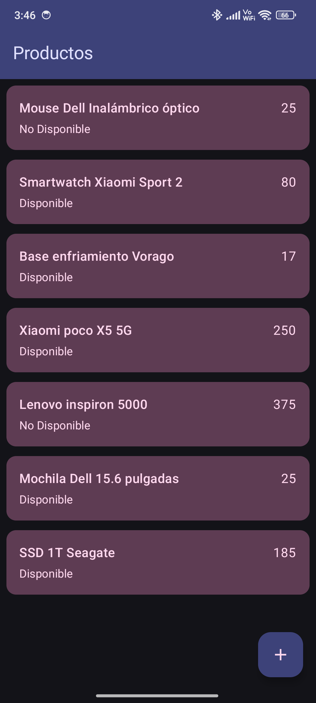
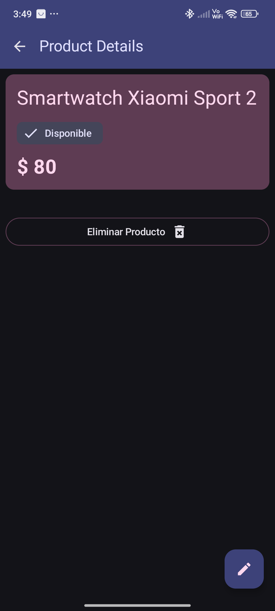
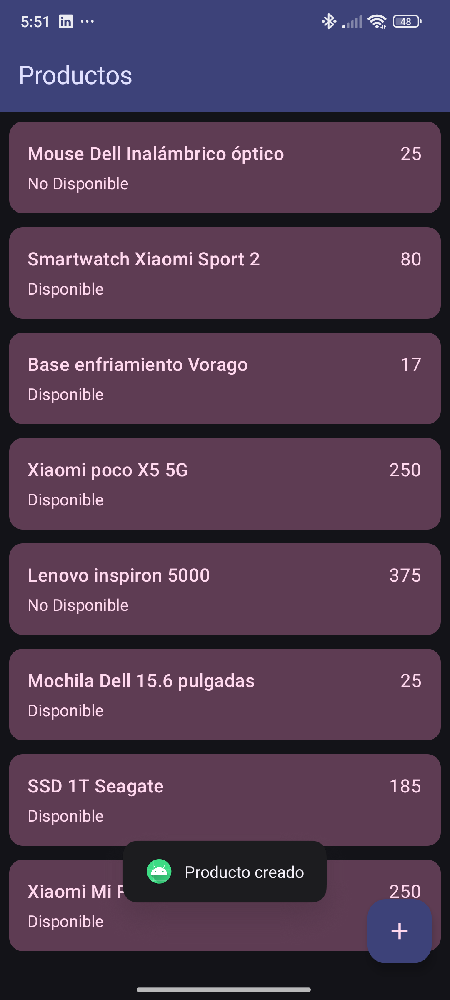

# Administrador de Productos Android - Kotlin - Jetpack Compose

CRUD de productos version mobile para Android utilizando Kotlin y Jetpack Compose con Material 3. 
Navegación de lado cliente tipada, peticiones de red tipadas (resources) utilizando _Ktor Client_, 
validación de datos e inyección de dependencias con Hilt.

## Tecnologías

* Kotlin: Lenguaje de programación.
* Jetpack Compose: UI y programación asíncrona con Coroutines y Flows.
* Navegación tipada.
* Ktor Client.
* MVVM: arquitectura y flujo unidireccional de datos (UDF), Repository pattern.
* Hilt: Inyección de dependencias.

> [!NOTE]
> Ver las versiones de las librerias en el version catalog.

## Flujo de la aplicación

1. Listado de productos y la opción de agregar nuevos productos utilizando Ktor client.

2. Validación lado cliente al momento de crear nuevos productos.

3. Detalles de los productos con la posibilidad de actualizar la disponibilidad o eliminar el 
producto de la base de datos.

4. Funcionalidad de editar la información de los productos y actualizar los datos.

5. Retroalimentación cuando se crean, actualizan o eliminan los productos exitósamente.

